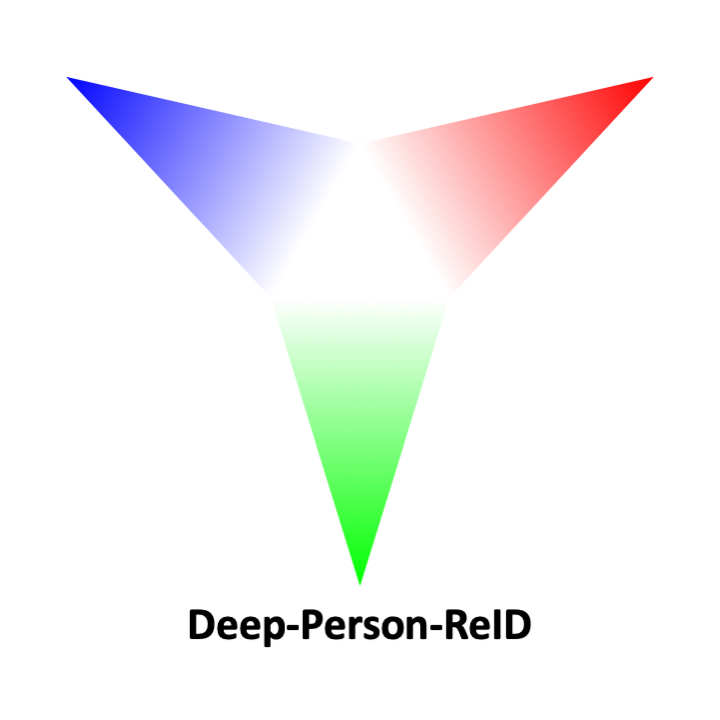

<p align="center">
  
</p>

This project aims to provide an efficient framework for training and evaluating deep person re-identification models in [Pytorch](http://pytorch.org/).

**Highlights**
- multi-GPU training.
- support both image reid and video reid.
- incredibly easy preparation of reid datasets.
- multi-dataset training.
- standard split protocol used by most research papers.
- end-to-end training and evaluation.
- implementations of state-of-the-art reid models.
- access to pretrained reid models.
- visualization of ranked results.
- state-of-the-art training techniques.

## Updates
- 05-03-2019: [Updated MobileNetV2; Added ImageNet-pretrained and ReID-trained models](https://github.com/KaiyangZhou/deep-person-reid/issues/116#issuecomment-469642881).
- 27-02-2019: Added QMUL-iLIDS and PRID. See [this issue](https://github.com/KaiyangZhou/deep-person-reid/issues/115) for details.
- 03-02-2019: [Added random erasing and staged learning rate training](https://github.com/KaiyangZhou/deep-person-reid/issues/110).
- 22-01-2019: Added [Market1501+500K](https://github.com/KaiyangZhou/deep-person-reid/issues/107).
- 06-01-2019: Released [Awesome-ReID](AWESOME_REID.md), a collection of ReID-related research with links to codes and papers.
- 26-11-2018: Released pretrained weights (imagenet & reid) for [shufflenet](torchreid/models/shufflenet.py).
- 23-11-2018: Released imagenet-pretrained weights for [resnext50_32x4d](torchreid/models/resnext.py).
- 11-11-2018: Added multi-dataset training; Added cython code for cuhk03-style evaluation; Wrapped dataloader construction to Image/Video-DataManager; Wrapped argparse to [args.py](args.py); Added [MLFN (CVPR'18)](https://arxiv.org/abs/1803.09132).

Note: Some changes will only be discussed in [issues](https://github.com/KaiyangZhou/deep-person-reid/issues). Please check issues with [new_feature](https://github.com/KaiyangZhou/deep-person-reid/issues?q=label%3Anew_feature) tag.

## Installation
1. `cd` to your preferred directory and run `git clone https://github.com/KaiyangZhou/deep-person-reid`.
2. Install dependencies by `pip install -r requirements.txt` (if necessary).
3. To install the cython-based evaluation toolbox, `cd` to `torchreid/eval_cylib` and do `make`. As a result, `eval_metrics_cy.so` is generated under the same folder. Run `python test_cython.py` to test if the toolbox is installed successfully. (credit to [luzai](https://github.com/luzai))

## Datasets
Image-reid datasets:
- [Market1501](https://www.cv-foundation.org/openaccess/content_iccv_2015/papers/Zheng_Scalable_Person_Re-Identification_ICCV_2015_paper.pdf) (`market1501`)
- [CUHK03](https://www.cv-foundation.org/openaccess/content_cvpr_2014/papers/Li_DeepReID_Deep_Filter_2014_CVPR_paper.pdf) (`cuhk03`)
- [DukeMTMC-reID](https://arxiv.org/abs/1701.07717) (`dukemtmcreid`)
- [MSMT17](https://arxiv.org/abs/1711.08565) (`msmt17`)
- [VIPeR](http://citeseerx.ist.psu.edu/viewdoc/download?doi=10.1.1.331.7285&rep=rep1&type=pdf) (`viper`)
- [GRID](http://www.eecs.qmul.ac.uk/~txiang/publications/LoyXiangGong_cvpr_2009.pdf) (`grid`)
- [CUHK01](http://www.ee.cuhk.edu.hk/~xgwang/papers/liZWaccv12.pdf) (`cuhk01`)
- [PRID450S](https://pdfs.semanticscholar.org/f62d/71e701c9fd021610e2076b5e0f5b2c7c86ca.pdf) (`prid450s`)
- [SenseReID](http://openaccess.thecvf.com/content_cvpr_2017/papers/Zhao_Spindle_Net_Person_CVPR_2017_paper.pdf) (`sensereid`)
- [QMUL-iLIDS](http://www.eecs.qmul.ac.uk/~sgg/papers/ZhengGongXiang_BMVC09.pdf) (`ilids`)
- [PRID](https://pdfs.semanticscholar.org/4c1b/f0592be3e535faf256c95e27982db9b3d3d3.pdf) (`prid`)

Video-reid datasets:
- [MARS](http://www.liangzheng.org/1320.pdf) (`mars`)
- [iLIDS-VID](https://www.eecs.qmul.ac.uk/~sgg/papers/WangEtAl_ECCV14.pdf) (`ilidsvid`)
- [PRID2011](https://pdfs.semanticscholar.org/4c1b/f0592be3e535faf256c95e27982db9b3d3d3.pdf) (`prid2011`)
- [DukeMTMC-VideoReID](http://openaccess.thecvf.com/content_cvpr_2018/papers/Wu_Exploit_the_Unknown_CVPR_2018_paper.pdf) (`dukemtmcvidreid`)

The keys to use these datasets are enclosed in the parentheses. See [torchreid/datasets/\_\_init__.py](torchreid/datasets/__init__.py) for details. The data managers of image-reid and video-reid are implemented in [torchreid/data_manager.py](torchreid/data_manager.py).

Instructions regarding how to prepare and do evaluation on these datasets are provided in [DATASETS.md](DATASETS.md).


## Models
### ImageNet classification models
- [ResNet](https://arxiv.org/abs/1512.03385)
- [ResNeXt](https://arxiv.org/abs/1611.05431)
- [SENet](https://arxiv.org/abs/1709.01507)
- [DenseNet](https://arxiv.org/abs/1608.06993)
- [Inception-ResNet-V2](https://arxiv.org/abs/1602.07261)
- [Inception-V4](https://arxiv.org/abs/1602.07261)
- [Xception](https://arxiv.org/abs/1610.02357)

### Lightweight models
- [NASNet](https://arxiv.org/abs/1707.07012)
- [MobileNetV2](https://arxiv.org/abs/1801.04381)
- [ShuffleNet](https://arxiv.org/abs/1707.01083)
- [SqueezeNet](https://arxiv.org/abs/1602.07360)

### ReID-specific models
- [MuDeep](https://arxiv.org/abs/1709.05165)
- [ResNet-mid](https://arxiv.org/abs/1711.08106)
- [HACNN](https://arxiv.org/abs/1802.08122)
- [PCB](https://arxiv.org/abs/1711.09349)
- [MLFN](https://arxiv.org/abs/1803.09132)

Please refer to [torchreid/models/\_\_init__.py](torchreid/models/__init__.py) for the keys to build these models. In the [MODEL_ZOO](MODEL_ZOO.md), we provide pretrained model weights and the training scripts to reproduce the results.

## Losses
- `xent`: cross entropy loss (the [label smoothing regularizer](https://www.cv-foundation.org/openaccess/content_cvpr_2016/papers/Szegedy_Rethinking_the_Inception_CVPR_2016_paper.pdf) can be enabled by `--label-smooth`).
- `htri`: [hard mining triplet loss](https://arxiv.org/abs/1703.07737).

## Tutorial
### Train
Training methods are implemented in
- `train_imgreid_xent.py`: train image-reid models with cross entropy loss.
- `train_imgreid_xent_htri.py`: train image-reid models with hard mining triplet loss or the combination of hard mining triplet loss and cross entropy loss.
- `train_vidreid_xent.py`: train video-reid models with cross entropy loss.
- `train_vidreid_xent_htri.py`: train video-reid models with hard mining triplet loss or the combination of hard mining triplet loss and cross entropy loss.

Input arguments for the above training scripts are unified in [args.py](args.py).

To train an image-reid model with cross entropy loss, you can do
```bash
python train_imgreid_xent.py \
-s market1501 \ # source dataset for training
-t market1501 \ # target dataset for test
--height 256 \ # image height
--width 128 \ # image width
--optim amsgrad \ # optimizer
--label-smooth \ # label smoothing regularizer
--lr 0.0003 \ # learning rate
--max-epoch 60 \ # maximum epoch to run
--stepsize 20 40 \ # stepsize for learning rate decay
--train-batch-size 32 \
--test-batch-size 100 \
-a resnet50 \ # network architecture
--save-dir log/resnet50-market-xent \ # where to save the log and models
--gpu-devices 0 \ # gpu device index
```

#### Multi-dataset training
`-s` and `-t` can take different strings (i.e. dataset keys) of arbitrary length (delimited by space). For example, if you wanna train models on Market1501 + DukeMTMC-reID and test on both of them, you can use `-s market1501 dukemtmcreid` and `-t market1501 dukemtmcreid`. If say, you wanna test on a different dataset, e.g. MSMT17, then just do `-t msmt17`. Multi-dataset training is implemented for both image-reid and video-reid. Note that when `-t` takes multiple datasets, evaluation is performed on each specified dataset individually.

#### Two-stepped transfer learning
To finetune models pretrained on external large-scale datasets, such as [ImageNet](http://www.image-net.org/), the [two-stepped training strategy](https://arxiv.org/abs/1611.05244) is recommended. This can be achieved by `--fixbase-epoch` and `--open-layers`. The pipeline goes as follows.

First, the base network is frozen and the randomly initialized layers (e.g. identity classification layer) are trained for `--fixbase-epoch` epochs. Specifically, the layers specified by `--open-layers` are set to the **train** mode and will be updated, while other layers are set to the **eval** mode and are frozen. See `open_specified_layers(model, open_layers)` in [torchreid/utils/torchtools.py](torchreid/utils/torchtools.py).

Second, after the new layers are adapted to the old (well-initialized) layers, all layers are set to the **train** mode (via `open_all_layers(model)`) and are trained for `--max-epoch` epochs.

For example, to train the randomly initialized classifier in [resnet50](torchreid/models/resnet.py) for 5 epochs before training all layers, do `--fixbase-epoch 5` and `--open-layers classifier`. Note that the layer names must align with the attribute names in the model (in this case, `self.classifier` exists in the model).

In addition, there is an argument called `--always-fixbase`. Once activated, the base network will be frozen and only the specified layers with `--open-layers` will be trained.

#### Using hard mining triplet loss
`htri` requires adding `--train-sampler RandomIdentitySampler`.

#### Training video-reid models
For video reid, `test-batch-size` refers to the number of tracklets, so the real image batch size is `--test-batch-size * --seq-len`. As the training follows the image-based paradigm, the semantic meaning of `train-batch-size` does not change.

### Test

#### Evaluation mode
Use `--evaluate` to switch to the evaluation mode. In doing so, **no** model training is performed. For example, say you wanna load pretrained model weights at `path_to/resnet50.pth.tar` for `resnet50` and do evaluation on Market1501, you can do
```bash
python train_imgreid_xent.py \
-s market1501 \ # this does not matter any more
-t market1501 \ # you can add more datasets here for the test list
--height 256 \
--width 128 \
--test-batch-size 100 \
--evaluate \
-a resnet50 \
--load-weights path_to/resnet50.pth.tar \
--save-dir log/eval-resnet50 \
--gpu-devices 0 \
```

Note that `--load-weights` will discard layer weights in `path_to/resnet50.pth.tar` that do not match the original model layers in size.

#### Evaluation frequency
Use `--eval-freq` to control the evaluation frequency and `--start-eval` to indicate when to start counting the evaluation frequency. This is useful when you want to test the model for every `--eval-freq` epochs to diagnose the training (the cython evaluation code is really fast, e.g. evaluation on Market1501 can be done in less than 10s).

#### Visualize ranked results
To visualize the ranked results, you can use `--visualize-ranks`, which works along with `--evaluate`. The ranked images will be saved in `save_dir/ranked_results/dataset_name` where `save_dir` is the directory you specify with `--save-dir`. This function is implemented in [torchreid/utils/reidtools.py](torchreid/utils/reidtools.py).

<p align="center">
  
</p>


## Citation
Please link this project in your paper.

## License
This project is under the [MIT License](LICENSE).